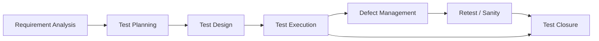
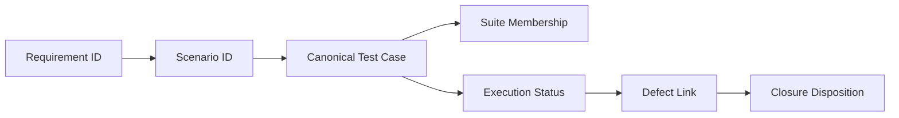

<div align="center">

# OrangeHRM Manual QA Portfolio

### End-to-End Manual Testing Repository — Requirement Analysis to Test Closure

[](#testing-approach)
[](#project-metrics)
[](#project-metrics)
[](#project-metrics)
[](#modules-covered)
[](#defect-summary)

**Application Under Test:** OrangeHRM Demo  
**Repository Type:** Manual QA Portfolio  
**Test Cycle Status:** Conditional Closure — defect reproduction and final disposition pending

</div>

---

## Project Overview

This repository presents a complete manual QA lifecycle for the **OrangeHRM Demo** web application. It is structured as a working QA repository rather than a collection of isolated test-case files.

The project connects:

**Requirement Analysis → Test Planning → Test Design → Test Execution → Defect Management → Test Closure**

All suites, execution records, defects, and closure documents reference the same canonical test-case baseline to maintain traceability and avoid duplicate sources of truth.

> **Evidence integrity:** The supplied execution baseline recorded 96 executed cases with 92 Pass and 4 Fail results. Detailed historical browser/build metadata, screenshots, and UI-level Actual Results were not available for the four failed cases. Those items are therefore controlled as **Open - Needs Reproduction** rather than being presented as fully evidenced defects.

---

## Project Metrics

| Metric | Result |
|---|---:|
| Requirements | **91** |
| Canonical Test Cases | **96** |
| Modules Covered | **13** |
| Executed | **96 / 96** |
| Passed | **92** |
| Failed | **4** |
| Blocked | **0** |
| Not Executed | **0** |
| Execution Completion | **100%** |
| Pass Rate | **95.83%** |
| Smoke Suite | **27 cases** |
| Regression Suite | **96 cases** |
| Sanity Suite | **20 cases** |
| Critical Path Suite | **20 cases** |
| Logged Defects | **4** |
| Unmapped Canonical Cases | **0** |

---

## Modules Covered

| Area | Modules |
|---|---|
| Authentication & Session | Login, Forgot Password, Session Management |
| Core HR | PIM, My Info, Directory |
| Administration | Admin |
| Workforce Operations | Leave, Time |
| Talent | Recruitment, Performance |
| Collaboration & Landing | Dashboard, Buzz |

---

## Testing Approach

The repository uses a risk-based manual testing approach with canonical functional cases reused across execution suites.

### Testing Types

- Functional positive testing
- Functional negative testing
- Input and required-field validation
- UI and navigation checks
- Smoke testing
- Full regression testing
- Post-fix sanity testing
- Critical-path testing
- Role and authorization checks
- Session and logout verification
- Security-oriented functional checks

> Security-oriented checks in this portfolio are functional QA scenarios and are **not** presented as a penetration test or formal security assessment.

---

## QA Lifecycle



The lifecycle is documented across the repository rather than described only in this README.

---

## Repository Structure

```text
OrangeHRM-Manual-Testing/
│
├── README.md
│
├── 01_Project_Information/
│   ├── Project_Overview.md
│   ├── Requirement_Analysis.md
│   ├── Application_Scope.md
│   ├── STLC.md
│   ├── SDLC.md
│   └── Test_Objectives.md
│
├── 02_Test_Planning/
│   ├── Test_Plan.md
│   ├── Test_Strategy.md
│   ├── Test_Environment.md
│   ├── Test_Estimation.md
│   ├── Risk_Assessment.md
│   └── Requirement_Traceability_Matrix.xlsx
│
├── 03_Test_Design/
│   ├── README.md
│   ├── Functional_Test_Cases/
│   │   ├── Login.xlsx
│   │   ├── Forgot_Password.xlsx
│   │   ├── Dashboard.xlsx
│   │   ├── Admin.xlsx
│   │   ├── PIM.xlsx
│   │   ├── Leave.xlsx
│   │   ├── Time.xlsx
│   │   ├── Recruitment.xlsx
│   │   ├── My_Info.xlsx
│   │   ├── Performance.xlsx
│   │   ├── Directory.xlsx
│   │   ├── Buzz.xlsx
│   │   └── Session.xlsx
│   ├── Smoke_Test_Suite.xlsx
│   ├── Regression_Test_Suite.xlsx
│   ├── Sanity_Test_Suite.xlsx
│   └── Critical_Path_Test_Cases.xlsx
│
├── 04_Test_Execution/
│   ├── README.md
│   ├── Test_Execution_Report.xlsx
│   ├── Execution_Summary.xlsx
│   ├── Defect_Log.xlsx
│   ├── Test_Data.xlsx
│   └── Screenshots/
│
├── 05_Defect_Reports/
│   ├── README.md
│   ├── BUG-001.md
│   ├── BUG-002.md
│   ├── BUG-003.md
│   └── BUG-004.md
│
└── 06_Test_Closure/
    ├── Test_Summary_Report.md
    ├── Lessons_Learned.md
    ├── Known_Limitations.md
    ├── Future_Improvements.md
    └── Metrics_Report.md
```

---

## Quick Navigation

### 01 — Project Information

| Document | Purpose |
|---|---|
| [Project Overview](01_Project_Information/Project_Overview.md) | Project context, baseline and QA governance |
| [Requirement Analysis](01_Project_Information/Requirement_Analysis.md) | QA-derived requirement baseline |
| [Application Scope](01_Project_Information/Application_Scope.md) | In-scope and out-of-scope boundaries |
| [STLC](01_Project_Information/STLC.md) | Test lifecycle used in the repository |
| [SDLC](01_Project_Information/SDLC.md) | QA relationship to delivery lifecycle |
| [Test Objectives](01_Project_Information/Test_Objectives.md) | Quality objectives and success criteria |

### 02 — Test Planning

| Document | Purpose |
|---|---|
| [Test Plan](02_Test_Planning/Test_Plan.md) | Scope, entry/exit criteria, reporting and governance |
| [Test Strategy](02_Test_Planning/Test_Strategy.md) | Risk-based test approach and suite strategy |
| [Test Environment](02_Test_Planning/Test_Environment.md) | ENV-DEMO-01 and environment controls |
| [Test Estimation](02_Test_Planning/Test_Estimation.md) | Manual execution and supporting QA effort |
| [Risk Assessment](02_Test_Planning/Risk_Assessment.md) | Product and execution risks |
| [Requirement Traceability Matrix](02_Test_Planning/Requirement_Traceability_Matrix.xlsx) | Requirement → scenario → test → suite → status → defect |

### 03 — Test Design

- [Functional Test Cases](03_Test_Design/Functional_Test_Cases/)
- [Smoke Test Suite](03_Test_Design/Smoke_Test_Suite.xlsx)
- [Regression Test Suite](03_Test_Design/Regression_Test_Suite.xlsx)
- [Sanity Test Suite](03_Test_Design/Sanity_Test_Suite.xlsx)
- [Critical Path Test Cases](03_Test_Design/Critical_Path_Test_Cases.xlsx)

### 04 — Test Execution

- [Test Execution Report](04_Test_Execution/Test_Execution_Report.xlsx)
- [Execution Summary](04_Test_Execution/Execution_Summary.xlsx)
- [Defect Log](04_Test_Execution/Defect_Log.xlsx)
- [Test Data](04_Test_Execution/Test_Data.xlsx)
- [Execution Evidence Folder](04_Test_Execution/Screenshots/)

### 05 — Defect Reports

- [BUG-001 — Login credential case sensitivity](05_Defect_Reports/BUG-001.md)
- [BUG-002 — Forgot Password account privacy](05_Defect_Reports/BUG-002.md)
- [BUG-003 — Recruitment email validation](05_Defect_Reports/BUG-003.md)
- [BUG-004 — ESS authorization restriction](05_Defect_Reports/BUG-004.md)

### 06 — Test Closure

- [Test Summary Report](06_Test_Closure/Test_Summary_Report.md)
- [Lessons Learned](06_Test_Closure/Lessons_Learned.md)
- [Known Limitations](06_Test_Closure/Known_Limitations.md)
- [Future Improvements](06_Test_Closure/Future_Improvements.md)
- [Metrics Report](06_Test_Closure/Metrics_Report.md)

---

## Test Design Standard

Canonical functional cases use a consistent structure:

| Field Group | Included Fields |
|---|---|
| Traceability | Requirement ID, Test Case ID |
| Classification | Module, Feature, Type, Priority, Severity |
| Design | Test Scenario, Preconditions, Test Steps, Test Data |
| Result | Expected Result, Actual Result, Status |
| Control | Comments |

Professional naming conventions are used throughout:

```text
Requirement: RQ-LGN-001
Scenario:    TS-LGN-001
Test Case:   TC-LGN-001
Defect:      BUG-001
Test Data:   TD-001
```

---

## Test Suite Strategy

### Smoke — 27 Cases

The smoke suite focuses on release-gating business flows such as:

- successful login;
- dashboard availability;
- employee creation and search;
- user administration;
- leave application and approval;
- timesheet submission and approval;
- candidate creation and search;
- employee directory search;
- logout.

### Regression — 96 Cases

The regression suite retains the complete canonical baseline across all 13 modules.

### Sanity — 20 Cases

The sanity suite is impact-based rather than a small duplicate regression suite. It contains:

- 4 primary retests for the historical failed cases;
- 16 adjacent guardrail tests around the affected functionality.

### Critical Path — 20 Cases

Critical workflows include:

- authentication and secure logout;
- employee onboarding and access provisioning;
- leave request to approval;
- timesheet entry to approval;
- recruitment vacancy to candidate progression;
- ESS authorization;
- directory search;
- performance review creation.

---

## Execution Summary

```text
Total:        96
Executed:     96
Passed:       92
Failed:        4
Blocked:       0
Not Executed:  0

Execution: 100.00%
Pass Rate:  95.83%
```

### Module Results

| Module | Total | Pass | Fail | Pass Rate |
|---|---:|---:|---:|---:|
| Login | 12 | 11 | 1 | 91.67% |
| Forgot Password | 5 | 4 | 1 | 80.00% |
| Dashboard | 5 | 5 | 0 | 100.00% |
| Admin | 10 | 10 | 0 | 100.00% |
| PIM | 16 | 16 | 0 | 100.00% |
| Leave | 10 | 10 | 0 | 100.00% |
| Time | 8 | 8 | 0 | 100.00% |
| Recruitment | 8 | 7 | 1 | 87.50% |
| My Info | 6 | 5 | 1 | 83.33% |
| Performance | 5 | 5 | 0 | 100.00% |
| Directory | 4 | 4 | 0 | 100.00% |
| Buzz | 3 | 3 | 0 | 100.00% |
| Session | 4 | 4 | 0 | 100.00% |

---

## Defect Summary

| Bug | Module | Linked Test | Severity | Priority | Current Status |
|---|---|---|---|---|---|
| [BUG-001](05_Defect_Reports/BUG-001.md) | Login | TC-LGN-012 | Medium | Medium | Open - Needs Reproduction |
| [BUG-002](05_Defect_Reports/BUG-002.md) | Forgot Password | TC-FGP-003 | High | Medium | Open - Needs Reproduction |
| [BUG-003](05_Defect_Reports/BUG-003.md) | Recruitment | TC-REC-005 | Medium | Medium | Open - Needs Reproduction |
| [BUG-004](05_Defect_Reports/BUG-004.md) | My Info | TC-MYI-004 | High | High | Open - Needs Reproduction |

`BUG-004` is the highest closure risk because it concerns ESS authorization and is also included in the Critical Path suite.

---

## Traceability

The final RTM maintains the following relationship:



Traceability outcome:

- **91 requirements**
- **96 canonical cases**
- **96 mapped cases**
- **0 unmapped cases**
- **4 failed cases linked to 4 defect records**

See the [Requirement Traceability Matrix](02_Test_Planning/Requirement_Traceability_Matrix.xlsx).

---

## Tools & Working Artifacts

| Tool / Format | Usage |
|---|---|
| OrangeHRM Demo | Application under test |
| Microsoft Excel-compatible workbooks | Test cases, suites, RTM, execution, defects, metrics |
| Markdown | Project, planning, defect and closure documentation |
| GitHub | Repository structure, version history and portfolio presentation |
| Web Browser | Manual application execution |

---

## Skills Demonstrated

- Requirement analysis and testability review
- Test planning and strategy
- Risk-based testing
- Test case design and standardization
- Positive and negative functional testing
- Smoke, regression and sanity suite design
- Critical-path analysis
- Requirement traceability
- Test data management
- Manual test execution reporting
- Defect triage and lifecycle control
- Severity and priority assessment
- Authorization and session testing
- Test metrics and management reporting
- Test closure and residual-risk communication
- QA documentation and repository governance

---

## Evidence & Screenshots

The original source workbook did not contain historical execution screenshots. Evidence has therefore **not been fabricated** for this portfolio.

The repository reserves:

```text
04_Test_Execution/Screenshots/
```

for evidence captured during future reproduction and retest cycles.

Recommended naming convention:

```text
<TestCaseID>_<BugID-or-Result>_<YYYYMMDD>.png
```

Examples:

```text
TC-LGN-012_BUG-001_20260910.png
TC-MYI-004_BUG-004_20260910.png
TC-PIM-002_PASS_20260910.png
```

---

## Known Limitations

This project intentionally distinguishes verified evidence from assumptions.

Key limitations include:

- no official OrangeHRM PRD/SRS was supplied;
- the requirement baseline is QA-derived from the supplied test cases;
- detailed evidence for the four historical failures was not retained;
- browser/version coverage was not evidenced in the source;
- a formal release-candidate build identifier was not available;
- the OrangeHRM Demo environment is shared and test data may change;
- dedicated performance, penetration, API, accessibility-certification and production-infrastructure testing are outside this baseline.

See [Known Limitations](06_Test_Closure/Known_Limitations.md) for the complete boundary.

---

## Closure Position

### Conditional — Pending Defect Reproduction and Disposition

Execution of the retained baseline is complete, but formal QA closure remains conditional.

Before final closure:

1. reproduce `BUG-001` through `BUG-004`;
2. capture browser/build details and evidence;
3. complete engineering/product triage;
4. retest delivered fixes through the Sanity Test Suite;
5. update the Defect Log and RTM;
6. record residual-risk acceptance where applicable.

See the [Test Summary Report](06_Test_Closure/Test_Summary_Report.md).

---

## Future Improvements

Planned improvement areas include:

- expanded boundary and Unicode validation;
- deeper role-based negative authorization;
- cross-browser execution;
- accessibility checks;
- API coverage where interfaces are available;
- performance baselines;
- automated smoke/regression coverage;
- CI execution and HTML reporting;
- screenshot/trace retention on failures;
- release-specific execution snapshots.

See [Future Improvements](06_Test_Closure/Future_Improvements.md).

---

## Portfolio Note

This repository is a QA portfolio built against the OrangeHRM Demo application. It is not an official OrangeHRM test repository and does not represent OrangeHRM vendor release approval, certification, or production sign-off.

---

<div align="center">

### Manual QA Repository — Requirement to Closure

**96 Test Cases · 13 Modules · 100% Executed · 95.83% Pass Rate · Full Traceability**

</div>
